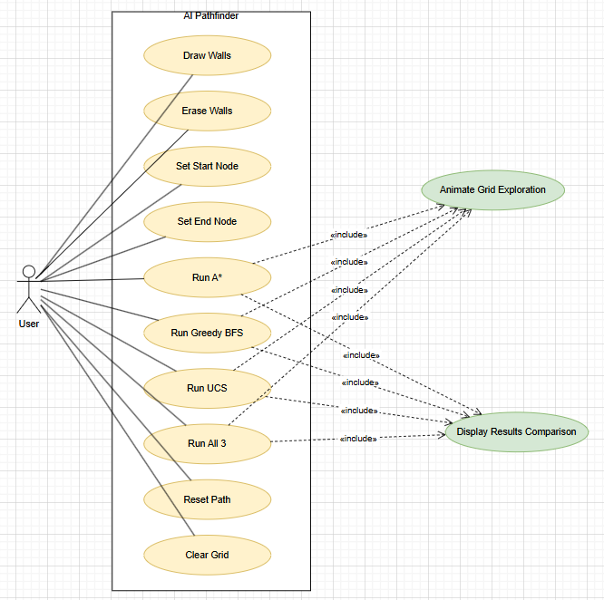
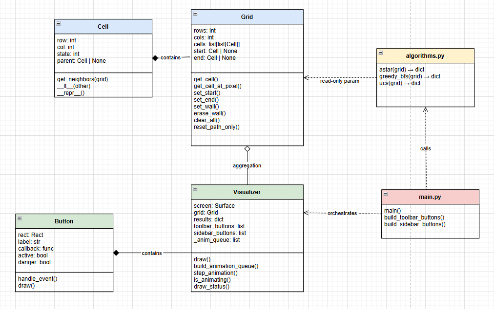
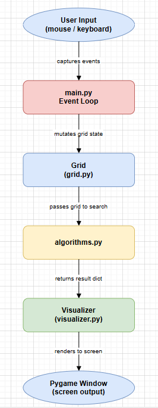

# SOFE 3720: Introduction to Artificial Intelligence @ Ontario Tech University.
# Final project: Pathfinding Visualizer

The purpose of this project is to apply core Artificial Intelligence search techniques to solve real-world pathfinding problems. We designed and implemented an intelligent grid-world visualization system that compares the performance and optimality of three core algorithms: **A* Search**, **Greedy Best-First Search**, and **Uniform Cost Search (Dijkstra)**. The system allows users to intuitively draw obstacles, set starting and ending states, and visually analyze how heuristics and cost functions affect the state-space exploration.
 
## Demo

- Draw walls, place a start and end node, then run any of the three algorithms
- Watch the exploration animate live on the grid
- Compare nodes explored, path length, and runtime across all three algorithms instantly

## Algorithms Implemented

| Algorithm | Strategy | Optimal? | Heuristic |
|---|---|---|---|
| A* | f(n) = g(n) + h(n) | Yes | Manhattan distance |
| Greedy Best-First | f(n) = h(n) only | No | Manhattan distance |
| Uniform Cost Search | f(n) = g(n) only | Yes | None |

All three are implemented from scratch using Python's `heapq` module - no pathfinding libraries used.

## Features

- Interactive 30×30 grid; click and drag to draw or erase walls
- Place start and end nodes anywhere on the grid
- Run a single algorithm or all three at once
- Live animation of the exploration and final path
- Sidebar comparison table showing nodes explored, path length, and runtime
- Automatic insights: e.g. "A* explores 60% fewer nodes than UCS"
- Reset path or clear the full grid without restarting

## Controls

| Input | Action |
|---|---|
| Wall mode + click/drag | Draw walls |
| Erase mode + click/drag | Remove walls |
| Start mode + click | Place start node |
| End mode + click | Place end node |
| Run A* / Greedy / UCS | Run a single algorithm |
| Run All 3 | Run all algorithms and compare |
| Reset Path | Clear exploration, keep walls |
| Clear Grid | Reset everything |
| R | Reset path (keyboard shortcut) |
| C | Clear grid (keyboard shortcut) |
| ESC | Quit |


## Project Structure
```
pathfinder/
├── main.py          # Entry point — event loop, button setup, mouse handling
├── algorithms.py    # A*, Greedy Best-First, and UCS implementations
├── grid.py          # Cell and Grid data model
├── visualizer.py    # All Pygame rendering and animation logic
├── ui.py            # Reusable Button component
├── constants.py     # Grid size, colours, state codes, timing config
└── requirements.txt # Dependencies
```


## Installation and Setup

**1. Clone the repository**
```bash
git clone https://github.com/harshpatel5/AI_pathFinder.git
cd AI_pathFinder
```

**2. Install dependencies**
```bash
pip install pygame
```
Or using the requirements file:
```bash
pip install -r requirements.txt
```

**3. Run the project**
```bash
python main.py
```
> Requires Python 3.10 or higher.

## Problem Formulation

To successfully implement the AI search, the pathfinding problem was formally modeled using the following components:

* **State Space ($S$):** The environment is a discrete 2D grid of size $R \times C$. Each distinct state $s \in S$ is represented by a cell coordinate $(row, col)$.
* **Input Features:** The grid configuration, including the precise starting location `START`, target location `END`, and the set of `WALL` (obstacle) coordinates.
* **Actions ($A$):** The agent can move orthogonally to any adjacent non-wall cell. The strict action space is: `{UP, DOWN, LEFT, RIGHT}`.
* **Constraints:** 
  1. The agent cannot move diagonally.
  2. The agent cannot pass through cells designated as `WALL` states.
  3. The agent cannot move outside the boundaries of the $R \times C$ grid.
* **Cost Function ($g$):** The step cost between any two adjacent, non-wall cells is exactly $1$. Therefore, the total path cost is the total number of orthogonal edges traversed on the path.
* **Objective Function:** Minimize the total path cost from the `START` state to the `END` state.
* **Justification for AI:** Pathfinding scaling is notoriously hard to compute through brute force. As grid-worlds get larger and more complex, checking every possible path combination leads to combinatorial explosion. By formulating this as an AI problem, we can use admissibility heuristics (like the Manhattan Distance) to drastically prune the search tree, ensuring the shortest path is found in a fraction of the time.


## AI Algorithm Implementation

The system implements the following algorithms purely from scratch without using any external short-path computation libraries. They rely heavily on a custom Priority Queue (`heapq`) data structure to prioritize state expansion.

### 1. A* Search
A* evaluates nodes by combining $g(n)$, the exact cost to reach the node, and $h(n)$, the heuristic estimated cost to get from the node to the goal. 
* **Evaluation Function:** $f(n) = g(n) + h(n)$
* **Heuristic:** We used **Manhattan Distance** ($|x_1 - x_2| + |y_1 - y_2|$), which is optimal and admissible because it never overestimates the true cost of reaching the target on a 4-way movement grid.
* **Result:** A* consistently found the optimal (shortest) path while expanding significantly fewer nodes than Uniform Cost Search.

### 2. Greedy Best-First Search
Greedy Best-First Search purely relies on the heuristic element and ignores the backward cost of the path.
* **Evaluation Function:** $f(n) = h(n)$
* **Result:** It is often the fastest algorithm to reach the target, but it is **not optimal**. As shown in our visualizer, it easily gets trapped or finds sub-optimal routes if walls are placed directly in the heuristic path.

### 3. Uniform Cost Search (UCS)
UCS is identical to Dijkstra's algorithm for unweighted graphs. It explores radially outwards by strictly considering the path cost so far.
* **Evaluation Function:** $f(n) = g(n)$ (where $h(n) = 0$).
* **Result:** It is mathematically guaranteed to find the absolute shortest optimal path but tends to be extremely slow and inefficient, expanding nodes in completely opposite directions of the true goal.

## System Design

The architecture follows standard Software Engineering principles separating state management, AI logic, and user interface rendering to maintain a modular codebase.

* **Grid Module (`grid.py`):** Acts as the data layer managing the $R \times C$ arrays of `Cell` objects and bounds validation.
* **Algorithms Module (`algorithms.py`):** Takes snapshots of the Grid state and performs mathematical iterations entirely independent of the UI logic, returning path data and exploration node counts.
* **Visualizer / UI System (`visualizer.py` & `ui.py`):** Manages the Pygame event loop, mouse tracking, frame rendering, and animating the queued algorithmic outputs dynamically onto the screen.

### UML Use Case Diagram



### UML Class Diagram



### Data Flow Diagram



## Requirements

- Python 3.10+
- pygame >= 2.5.0


## Authors

- Harsh Patel
- Prabhnoor Saini
- Khushi Patel

> Academic Project - Ontario Tech University - SOFE 3720, March 2025
